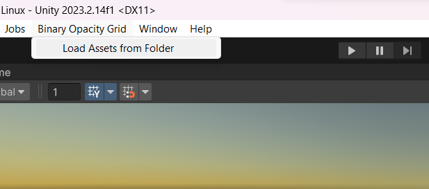
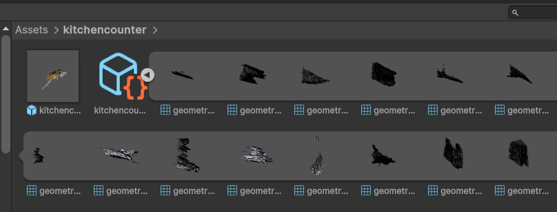

# UnityBinaryOpacityGrid

Import and realtime rendering of pre-generated [Binary Opacity Grids](https://binary-opacity-grid.github.io/) in Unity. 


This repository contains the following components:

# 1. Utility Scripts
Utility Python scripts, required libraries for the scripts can be installed using `pip`.

```
pip install -r "Utility Scripts\requirements.txt"
```

* **`Utility Scripts\DownloadBOGSamples.py`** Allows for downloading Binary Opacity Grid sample scenes that are provided by the authors of the paper. You can run the script by specifying the path where you want to download the files, and a sample scene name:
`["bicycle", "flowerbed", "gardenvase", "stump", "treehill", "kitchenlego", "fulllivingroom", "kitchencounter", "kitchenlego", "officebonsai"]`. 
 Alternatively, use the `--all` flag to download all the available sample scenes. 

```
python3 "Utility Scripts\DownloadBOGSamples.py" "Path/where/to/download/" --name SceneName
```

* **`Utility Scripts\BakeIntoMesh.py`** This script bakes the sparse grid feature maps in the first 3 UV channels of each vertex. 
The [official renderer](https://github.com/binary-opacity-grid/binary-opacity-grid.github.io/blob/main/viewer/sg_renderer.js) provided by the authors of the paper requires rendering multiple passes to render the 3D feature maps into 2D feature maps that are used in the final pass to render the output. As an optimization, **UnityBinaryOpacityGrid** bakes the feature maps per vertex and uses a single pass to render the mesh at runtime. In addition, all the .raw files of feature maps will not be required after baking.
The script outputs a new *.glb* file with the name *FullMeshWithFeatures.glb*

```
python3 'Utility Scripts\BakeIntoMesh.py' "Path/to/glb/file"
```

# 2. Package
This is a Unity package that contains the editor scripts for importing the required assets and the shader for rendering the Binary Opacity Grids.

After cloning the repository, you can add this package to your project following this guide: [Install a package from a local folder](https://docs.unity3d.com/Manual/upm-ui-local.html)


# 3. BinaryOpacityGridSample
A sample project that uses the Binary Opacity Grid package. 

You can import a Binary Opacity Grid scene by selecting a folder that contains a baked mesh (**FullMeshWithFeatures.glb**), a json file that contains the scene parameters (**scene_params.json**), and all triplane feature files (**plane_features__.raw**)




After a successful import, you can find the new assets and a prefab under `Assets/SceneName/`



## References
* [Binary Opacity Grids: Capturing Fine Geometric Detail for Mesh-Based View Synthesis](https://binary-opacity-grid.github.io/)

* [Binary Opacity Grids official viewer github repo](https://github.com/binary-opacity-grid/binary-opacity-grid.github.io/tree/main/viewer)

